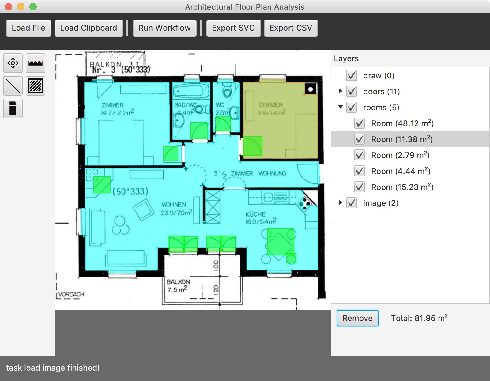

# Automatic analysis and simplification of architectural floor plans [](https://travis-ci.org/cansik/architectural-floor-plan) [](https://codebeat.co/projects/github-com-cansik-architectural-floor-plan)
This software is an architectural floor plan analysis and recognition system to create extended plans for building services.

## Abstract
The goal of this work is, to do a fast and robust room detection on floor plans. The idea is, that a wide range of non standardized floor plans can be analyzed, time efficient, with little drawbacks in its precision.
The used workflow consists of several algorithms, that are combined to deliver the expected result. It consists of *Morphological cleaning* for noise removal, *Machine Learning* and *Convex Hull closing* for gap closing and a *Connected Component analysis* for the final room detection. It is the best result out of different approaches that were tested. All of the algorithms used, use an image of a plan  as the start for detection and return the location and size of each room as a CSV-table or SVG-vectors. The software is prepared to return the rooms as a DWG- or DXF-Format for a CAD-Program, but the license for a library, to convert the format, is not finally evaluated.
The algorithm implemented, shows improvement in room detection accuracy, compared to similar works done in the last few years. The room accuracy for the algorithm itself, for cleaned images, is on average 84 percent. It can be improved with user interaction, by using the editor. Then the room detection rate is able to reach between 95 to 100 percent.

* Contact: [Florian Bruggisser](mailto:florian@bildspur.ch)
* Documentation: [AASAFP_BruggisserWyss_2017.pdf](https://github.com/cansik/architectural-floor-plan/releases/download/v1.0/AASAFP_BruggisserWyss_2017.pdf)



## Installation
The software is still a prototype and not packaged into an executable. To run the software, you have to run the `run.sh` (Unix) or `run.bat` \ `run64.bat`  (Windows).

## Development prerequisites
For development on the existing project, you have to install the JDK 8 (Java Development Kit). The download link to the JDK is the following:

[JDK 8 Download](http://www.oracle.com/technetwork/java/javase/downloads/jdk8-downloads-2133151.html)

The project itself can be built with the [gradle build tool](https://gradle.org/).

```bash
// unix
gradlew build

// windows
gradle.bat build
```


## About
*FHNW Bachelor Computer Science*

*Alexander Wyss and [Florian Bruggisser](mailto:florian@bildspur.ch)*
