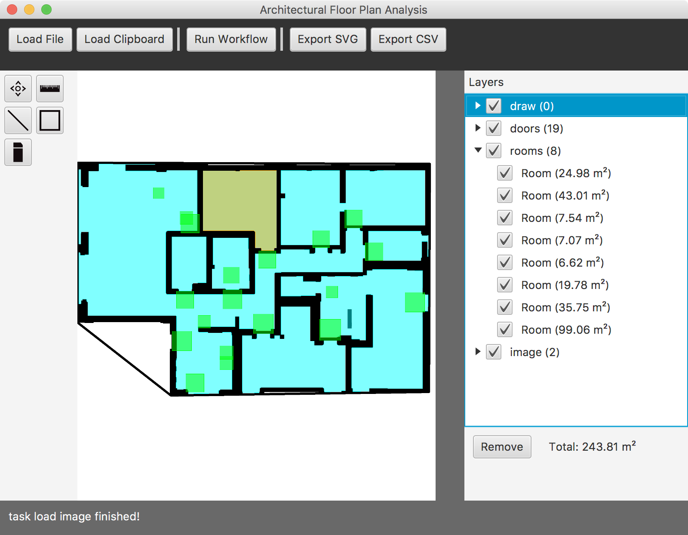

# Architectural Floor Plan Analysis and Recognition System  
AFPARS is an architectural floor plan analysis and recognition system to create extended plans for building services.

## Description
The goal of the project is a software that automatically detects room geometries and thus intrinsically continuously records the necessary polygons. The software reads plans as DXF / DWG , calculates them and exports it back as DXF / DWG. To calculate those polygons, various geometrical methods as well as an extensible library of architectural elements are to be used.

## About
*Alexander Wyss and Florian Bruggisser*
